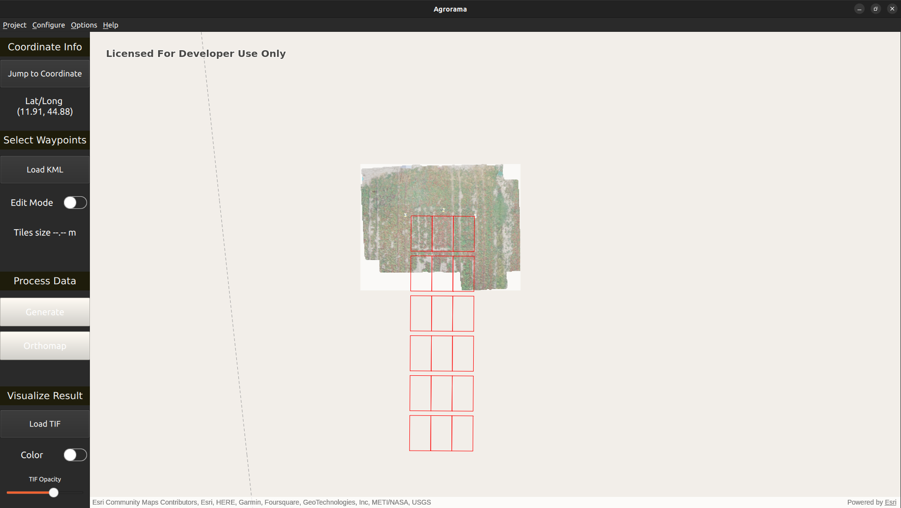

# AGR-o-RAMA-GUI

Welcome to the AGR-o-RAMA User Interface Usage Documentation. This guide provides detailed instructions on how to install and use the ui effectively.  

## Table of Contents

- [AGR-o-RAMA-GUI](#agr-o-rama-gui)
  - [Table of Contents](#table-of-contents)
  - [Install](#install)
  - [Overview](#overview)
  - [Projects](#projects)
    - [New Project](#new-project)
    - [Open Project](#open-project)
    - [Settings](#settings)
  - [Map](#map)
    - [Normal mode](#normal-mode)
    - [Edit mode](#edit-mode)
  - [Control Panel](#control-panel)
    - [Mission Planning](#mission-planning)
    - [Results Visualization](#results-visualization)
  - [UI Elements](#ui-elements)

## Install

To satisfy the user interface dependencies, follow these steps:

1. **Install Qt 6.5.1 (or higher)**: metti link e roba varia. Se diventa corposo, facciamo una sotto sezione ###

2. **Install ArcGIS**: link all'installazione e due parole su come installarlo.

## Overview

The user interface lets you interact asynchronously with the drones, sending requests in the form of waypoints selected on a map, in order to adequately record the field from different points of view and ultimately reconstruct a 3D view of it and identify features of interest. After that, you can visualize the reconstructed orthomap on top of the map. The graphical interface is made of three main parts: the menu bar at the top (for projects and settings), the control panel on the left and, finally, the map.
  

## Projects

When the program is launched, the API key for ArcGIS is requested. If it is correct, the main window with the map will be shown. Otherwise, the main window will still be shown, but the map will not be loaded.
The API key is saved in a file in the $arcgis$ folder, so that the next time the program is launched, the key is automatically retrieved from that file.

### New Project

To create a new project, click **Project** > **New** and fill in all the required information.

### Open Project

To open a project, click **Project** > **Open** and choose a YAML file to open.

### Settings

To change the information fields will populate the YAML file, click **Configure** > **Settings**.

## Map

It can be in two modes: normal mode or edit mode. In the latter, you can select the tiles to be used as waypoints for the drone. The controls in one mode are not choosable in the other mode.

### Normal mode

- <kbd>a</kbd> &rarr; rotate left
- <kbd>d</kbd> &rarr; rotate right
- <kbd>+</kbd> &rarr; zoom in
- <kbd>-</kbd> &rarr; zoom out
- You can also zoom in by using left and right double click of the mouse, respectively for zooming in and out, or also the mouse wheel/trackpad.

### Edit mode

- <kbd>left mouse click</kbd> &rarr; select a tile
- <kbd>right mouse click</kbd> &rarr; deselect a tile
- Slider on the right to increase (knob up) or decrease (knob down) the tile size

## Control Panel

### Mission Planning

The right order of steps from the creation of a project to the generation of the orthomap is the following one:

1. Create a new project by selecting the file paths of your choice (or open an existing one)
2. (Optional) Load a KML file
3. Activate the Edit Mode
4. Select the desired tiles
   (**Disclaimer:** If you increase/decrease the tiles size while the edit mode is activated, the previous selected tiles will be deleted)
5. (Optional) Change settings
6. (Optional) Activate $use$ $cuda$ flag, clicking on **Options** > **use cuda**
7. Click **Generate** to generate CSV and YAML files
8. Click **Orthomap** to render images
9. Wait until the process is ended

### Results Visualization

- Once the orthomap has been generated, it can be visualized on top of the map and also on top of the .kml layer. When clicking on the TIF button, the $output$ folder will be opened and the images can be selected. Only one tif at a time can be visualized on the map.
- The orthomap can also be colored, to show altitude features, through the switch
- Through the slider at the bottom, you can adjust the opacity of the .tif image, to check if the reconstruction is accurate based on the underlying data
  

## UI Elements

Spiegare tutte le cose che rimangono (boh tipo light/dark mode e la sezione Help>About). Se trovate un titolo migliore cambiatelo pure.
