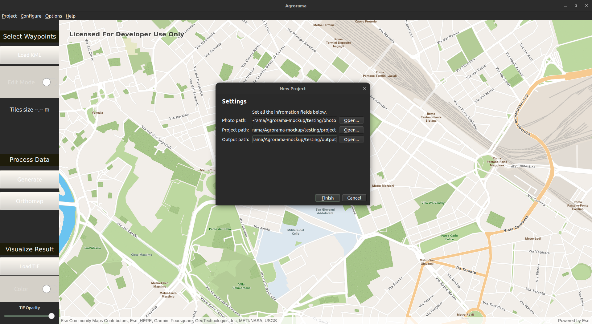
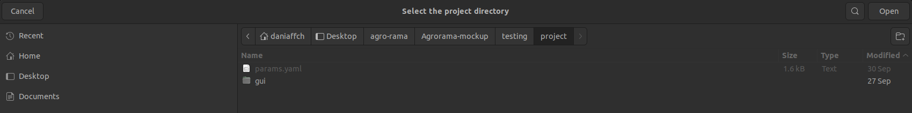
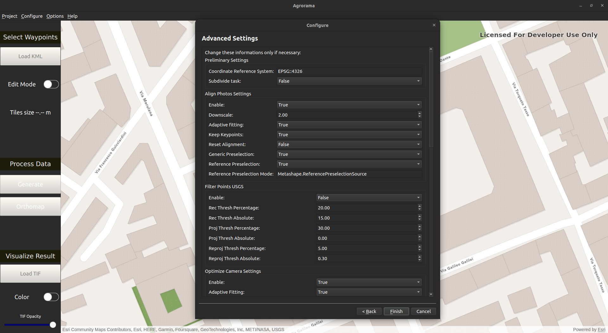
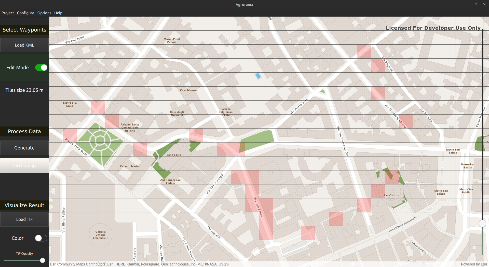
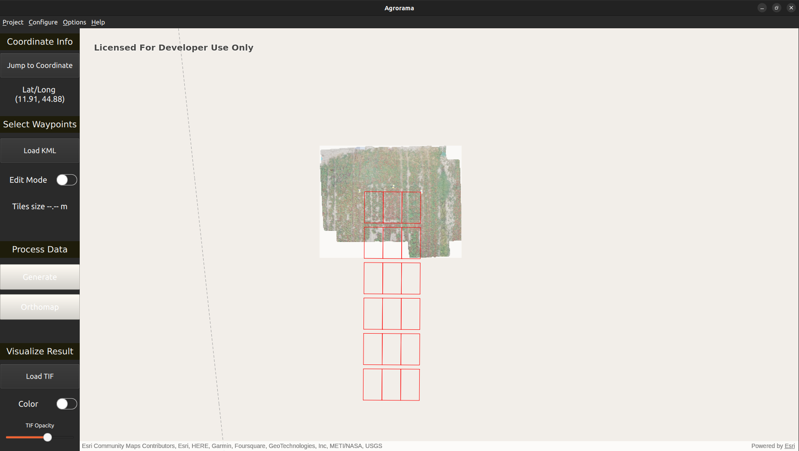

# AGR-o-RAMA-GUI

Welcome to the AGR-o-RAMA User Interface Usage Documentation. This guide provides detailed instructions on how to install and use the ui effectively.  

## Table of Contents

- [AGR-o-RAMA-GUI](#agr-o-rama-gui)
  - [Install](#install)
  - [Run](#run)
  - [Overview](#overview)
  - [GUI Projects](#gui-projects)
    - [Project](#project)
    - [Configure](#configure)
  - [Map](#map)
    - [Normal mode](#normal-mode)
    - [Edit mode](#edit-mode)
  - [Control Panel](#control-panel)
    - [Mission Planning](#mission-planning)
    - [Results Visualization](#results-visualization)

## Install

To satisfy the user interface dependencies, follow these steps:

- Download the release and execute the script **setup** that will launch two installers of Qt 6.5 (or higher) and Arcgis Maps SDK
- Select custom installation and select any Qt version above 6.5
- Follow the steps of both installers
- **Important** : don't change the installation folder

## Run

Execute the program either by the script **launch** or by the desktop file

## Overview

The user interface lets you interact asynchronously with the drones, sending requests in the form of waypoints selected on a map, in order to adequately record the field from different points of view and ultimately reconstruct a 3D view of it and identify features of interest. After that, you can visualize the reconstructed orthomap on top of the map. The graphical interface is made of three main parts: the menu bar at the top (for projects and settings), the control panel on the left and, finally, the map.
  

## GUI Projects

When the program is launched, the API key for ArcGIS is requested. If it is correct, the main window with the map will be shown. Otherwise, the main window will still be shown, but the map will not be loaded.
The API key is saved in a file in the $arcgis$ folder, so that the next time the program is launched, the key is automatically retrieved from that file. 
The Menu Bar is situated at the top of the Application Window. Its purpose is to enable users to handle/create projects. Each project is uniquely identified by a photo, project, and output path. Specifically, the `project` contains GUI data, while `photo` and `output` are necessary for third-party software. The Menu Bar consists of four sections:

- **Project**: For creating or opening projects
- **Configure**: For modifying default parameters once a project is properly loaded
- **Options**: Miscellaneous options (currently only CUDA)
- **Help**: Provide a reference to this guide

### Project
  This section contains two main subsections:
  - *New*: Creates a new project. During this process, you are required to define and select three directories: photo, project, and output. If any issues arise, an error message will be displayed, and the project creation will be aborted.

  

  - *Open*: Allows the user to open an already existing project. To do this, the user needs to select a valid project folder, which should contain a `params.yaml` file (as illustrated in the example picture). If the selected folder is valid, the photo and output paths will be retrieved accordingly; otherwise, an error message will be displayed.

  

### Configure
  If a project is opened correctly, it's possible to modify all the advanced settings related to the project which affects the orthomap generation as well. 

## Map

It can be in two modes: normal mode or edit mode. In the latter, you can select the tiles to be used as waypoints for the drone. The controls in one mode are not choosable in the other mode.

### Normal mode

- <kbd>a</kbd> &rarr; rotate left
- <kbd>d</kbd> &rarr; rotate right
- <kbd>+</kbd> &rarr; zoom in
- <kbd>-</kbd> &rarr; zoom out
- You can also zoom in by using left and right double click of the mouse, respectively for zooming in and out, or also the mouse wheel/trackpad.
- You can jump to arbitrary coordinates (longitude latitude) by the top button

### Edit mode

- <kbd>left mouse click</kbd> &rarr; select a tile
- <kbd>right mouse click</kbd> &rarr; deselect a tile
- Slider on the right to increase (knob up) or decrease (knob down) the tile size.

## Control Panel

### Mission Planning

The right order of steps from the creation of a project to the generation of the orthomap is the following one:

1. Create a new project by selecting the file paths of your choice (or open an existing one)
2. (Optional) Load a KML file
3. Activate the Edit Mode
4. Select the desired tiles
   (**Disclaimer:** If you increase/decrease the tiles size while the edit mode is activated, the previous selected tiles will be deleted)
5. (Optional) Change settings
6. (Optional) Activate $use$ $cuda$ flag, clicking on **Options** > **use cuda**
7. Click **Generate** to generate CSV and YAML files
8. Click **Orthomap** to render images
9. Wait until the process is ended (during this process the GUI is locked and there is the following animation until the orthomaps are generated)

### Results Visualization

- Once the orthomap has been generated, it can be visualized on top of the map and also on top of the .kml layer. When clicking on the TIF button, the $output$ folder will be opened and the images can be selected. Only one tif at a time can be visualized on the map.
- The orthomap can also be colored, to show altitude features, through the switch
- Through the slider at the bottom, you can adjust the opacity of the .tif image, to check if the reconstruction is accurate based on the underlying data.

